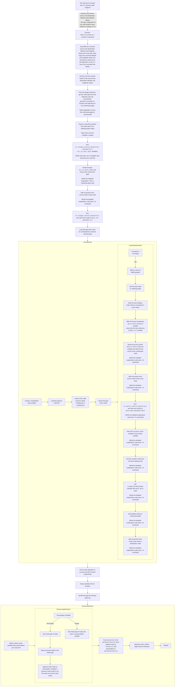

# Flowchart
- Descriptions are written context-wise and the finer details like extra iterations aren't mentioned.

```mermaid
flowchart TD
    start["API Call from Frontend with '/k_shortest_path' endpoint"] 
    -- "Backend will receive source and destination latitude and longitude values,
    the type of algorithm to use and boolean value whether to debug or not" -->
    runFunction["Execute <code>kShortestPaths()</code> function in backend"] -->
    assembleValuePairs["Assemble the received source and destination latitude and longitude values into a key pair value map (The received latitude and longitude values are received as string so for the algorithm to use it, it has to be converted into floats)"] -->
    getNearestNodes["Get the id of the nearest nodes to the source and destination latitude and longitude values"] -->
    
    add_node_to_minimizedGraph["From the graph reference, get the node data from the obtained node ids executed by <code>getNearestNodes()</code> function and add them to the minimized graph<br/><br/>(Add explanation of how the minimized graph is constructed)"]
    -->
    initCoordToWalkingNode["Create a map that contains key value pairs from walking graph nodes<br/><br/>(Type here why this variable is made)"]
    -->
    run_singel_source_dijkstra["Run <code>nx.single_source_dijkstra()</code> and save it in 2 <code>src_to_test_dist</code> variables <br/><br/>(Write why there are 2 variables and what they are used for)"]
    -->
    remove_osmid["Iterate through <code>src_to_dest_path</code> and remove key osmid from path<br/><br/>(Write the detailed explanation. This is confusing right now)"]
    -->
    connectSourceToDest["Add connection from source node to dest node<br/><br/>(Write the detailed explanation code-wise. I'm confused)"]
    -->
    singelSourceDijkstra_saveToDistAndPath["Run <code>nx.single_source_dijkstra()</code> and save the results to <code>dist_src</code> and <code>path_src</code>"]
    -->
    loopThroughEachRoute["Loop through each route for srcNodeUser to find its shortest path"]
    -->
    srcNodeUser

    subgraph srcNodeUser
        srcNodeUser_routeNodes["Create a routeNodes<br/> map variable"]
        -->
        srcNodeUser_loadGeojson["Load the geojson<br/> node file"]
        -->
        srcNodeUser_defineNorthSouthBounds["Check if the node<br/> bound is either<br/> northbound or<br/> southbound"]
        -->
        iterateThroughNodes["Iterate through<br/> route nodes"]
        -->
        routeNodesIteration
        subgraph routeNodesIteration
            ifRouteArr["If routeArr is<br/>not empty"]
            -- "Yes" -->
            makeRouteOnWalkingGraph["Make a route on<br/> walking graph"]
            -->
            getBestNodeOnWalkingGraph["Get the best node<br/> on walking graph"]
            -->
            useBestWalkingNode_thenFindRouteNodeCounterpart["With the best walking node, find its counterpart in route nodes"]
            -->
            setSrcToFirstRoute["With the found counterpart,<br/> set <code>srcToFirstRoute</code> variable<br/>value with the key reference<br/>of <code>path_src</code> variable"]
            -->
            removeAndAddOsmidInSrcToFirstRoute["Remove the key osmid from <code>srcToFirstRoute</code> variable and add the key osmid of the counterpart node<br/><br/>(Write the detailed explanation code-wise. I'm confused)"]
            -->
            addConnectionFromSrcToFirstRoute["Add connection from source node to first route node<br/><br/>(Write the detailed explanation code-wise. I'm confused)"]
            -->
            runMultiSourceDijkstra["Run <code>nx.multi_source_dijkstra()</code> and save the results to <code>dist_dest</code> and <code>path_dest</code><br/><br/>(Write the detailed explanation code-wise. I'm confused)"]
            -->
            savePathDestToBestNode["Save idx 0 of <code>path_dest</code> variable to <code>bestNode</code> variable<br/><br/>(Write the detailed explanation code-wise. I'm confused)"]
            -->
            getRouteArrNodeFromBestWalkingNode["Get the routeArr node from the best walking node<br/><br/>(Write the detailed explanation code-wise. I'm confused)"]
            -->
            setSrcRouteToDestNode_withPathDest["Set <code>srcRouteToDestNode</code> variable with <code>path_dest</code> value<br/><br/>(Write the detailed explanation code-wise. I'm confused)"]
            --> 
            addWalkingNodesToMinimizedGraph["Add walking nodes to minimized graph<br/><br/>(Write the detailed explanation code-wise. I'm confused)"]
            -->
            addConnectionFromRouteBestNodeToDestNode["Add connection from route's best node to destination node<br/><br/>(Write the detailed explanation code-wise. I'm confused)"]

        end

    end

    srcNodeUser -->  
    checkAlgoType["Check what algorithm to use and execute function respectively"]
    -->
    setupVariablesForIteration["Setup variable inits for iteration"]
    -->
    iterateaThroughShortestPaths["Iterate through the shortest paths list"]
    -->
    RouteListIteration

    subgraph RouteListIteration
        
        makeBlockScopeVariable["Make a block scope variable about permutation per route item"] --> RouteLengthIteration
        subgraph RouteLengthIteration
            permutationVariable["Permutation Variable"]

            permutationVariable -- "Not Empty" -->
            permutationYes["Get mode type of node"]
            -->
            removeBoundSuffix["Remove bound suffix in the mode type"]
            -->
            appendModeToPermutation["Append node mode to permutation variable if previous node mode is not the same as current node mode"]

            permutationVariable -- "Empty" -->
            permutationNo["Get mode type of node and save it to permutation variable"]
        end

        RouteLengthIteration --> 
        permutationCheck["If <code>permutation</code> not in <code>permutationList</code> then append route to <code>routeList</code> and permutation to <code>permutationList</code>"]
        -->
        buildReturJSON["Build the return JSON object back to frontend"]
        -->
        finish["FINISH"]
    end
```