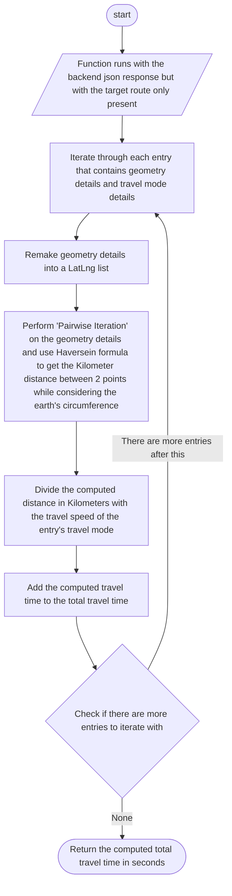

# Computing Travel Duration

```mermaid
flowchart TD
    startOperation(["start"]) -->
    prepareData[/"Function runs with the backend json response but with the target route only present"/] -->
    iterateThroughEntries["Iterate through each entry that contains geometry details and travel mode details"] -->
    remakeGeometryDetails["Remake geometry details into a LatLng list"] -->
    iterateThroughGeometry["Perform 'Pairwise Iteration' on the geometry details and use Haversein formula to get the Kilometer distance between 2 points while considering the earth's circumference"] -->
    computeTravelTimeForThisEntry["Divide the computed distance in Kilometers with the travel speed of the entry's travel mode"] -->
    addItToTheTotalTravelTime["Add the computed travel time to the total travel time"]

    --> checkIfTheresMoreToIterate{"Check if there are more entries to iterate with"}

    checkIfTheresMoreToIterate -- "There are more entries after this" --> iterateThroughEntries
    checkIfTheresMoreToIterate -- "None" --> returnValue(["Return the computed total travel time in seconds"])
```