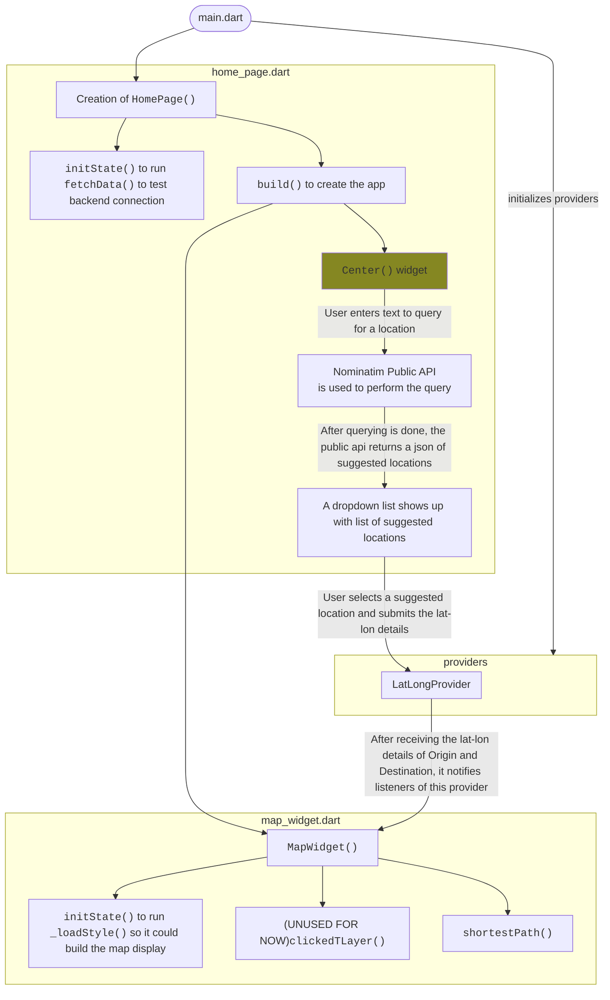

# App Architecture

```mermaid
flowchart TD
    main(["main.dart"])
    subgraph home_page.dart
        homePage["Creation of <code>HomePage()</code>"]
        init["<code>initState()</code> to run <code>fetchData()</code> to test backend connection"]

        buildApp["<code>build()</code> to create the app"]

        home_inputs["<code>Center()</code> widget"]
        home_select_loc["Nominatim Public API
            is used to perform the query"]
        home_selection_of_locations["A dropdown list shows up with list of suggested locations"]
        

    end

    subgraph map_widget.dart
        map_widget["<code>MapWidget()</code>"]
        map_init["<code>initState()</code> to run <code>_loadStyle()</code> so it could build the map display"]
        map_todaClick["(UNUSED FOR NOW)<code>clickedTLayer()</code>"]
        map_shortestPath["<code>shortestPath()</code>"]
    
    end

    subgraph providers
        subgraph LatLongProvider

        end
    end

    %% ============================

    main --> homePage
    main -- "initializes providers" --> providers

    %% ============================

    homePage --> init
    homePage --> buildApp
    
    %% ============================

    buildApp --> home_inputs
    home_inputs -- "User enters text to query for a location" --> home_select_loc
    home_select_loc -- "After querying is done, the public api returns a json of suggested locations" --> home_selection_of_locations
    home_selection_of_locations -- "User selects a suggested location and submits the lat-lon details" --> LatLongProvider

    buildApp --> map_widget

    %% ============================

    map_widget --> map_init
    map_widget --> map_todaClick
    map_widget --> map_shortestPath

    %% ============================

    LatLongProvider -- "After receiving the lat-lon details of Origin and Destination, it notifies listeners of this provider" --> map_widget

    %% ============================

    classDef userInput fill:#858722
    class home_inputs userInput
```
