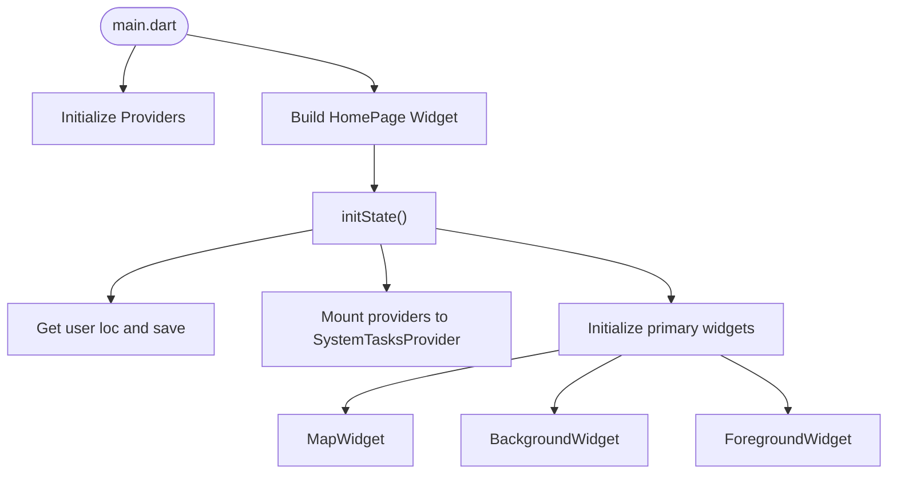
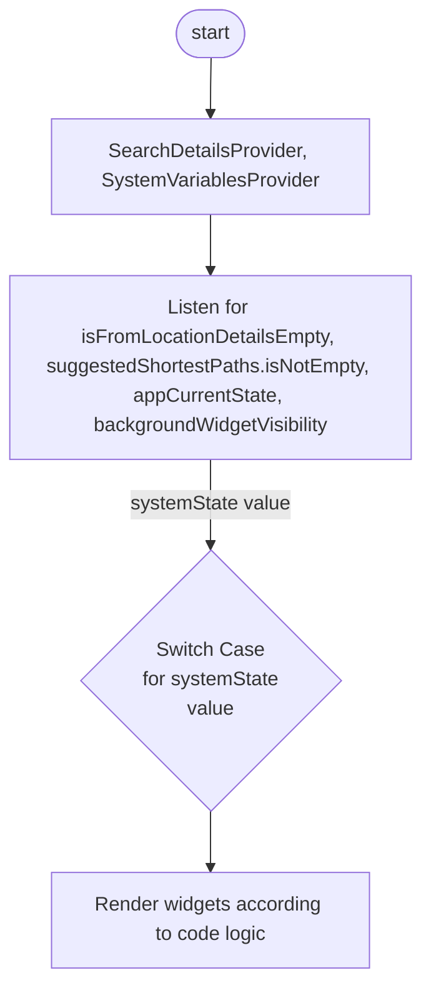
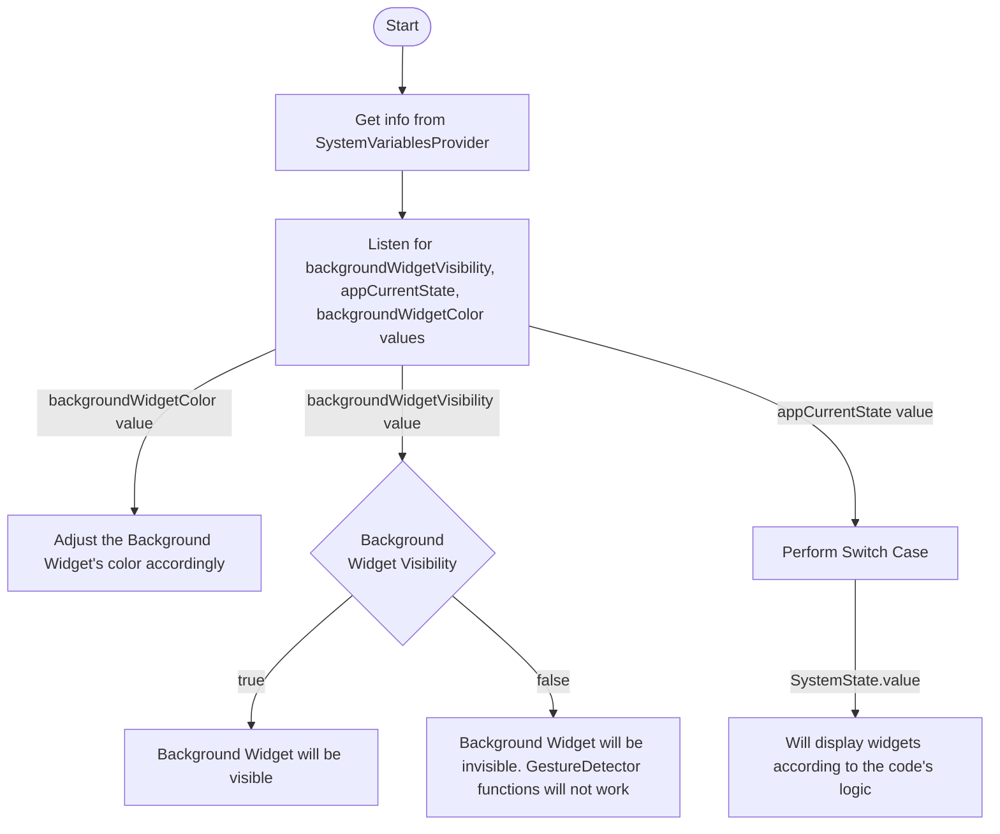

# App Architecture

## Top Layer
- Consists of app initialization code and the location of the primary widgets

### Layering Visual

:::info
It's assembled this way in order to easily manage what widgets to appear based on app state
:::

## Primary Widgets

### Foreground Widget

### Background Widget
